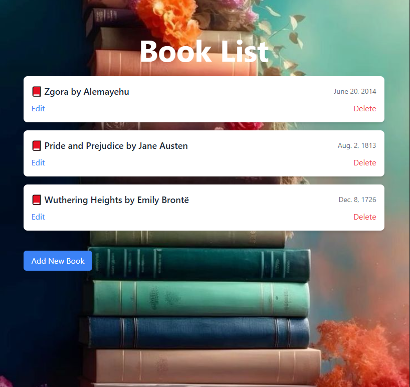

Django CRUD Book Management System

Overview

This is a simple Django-based CRUD (Create, Read, Update, Delete) application for managing books. Users can add new books, update details, delete entries, and view a list of books. The UI is styled using Tailwind CSS.

Features

Add new books with title, author, and published date

Edit existing book details

Delete books from the list

View all books in a structured list format

Technologies Used

Python (Django Framework)

HTML, CSS (Tailwind CSS)

SQLite (Default Django Database)

Installation & Setup

Clone the repository:

git clone https://github.com/HiwotAddis/Django-CRUD-Book-Management-System.git

Apply migrations and run the server:

python manage.py migrate
python manage.py runserver

Open the application in your browser:

http://127.0.0.1:8000/

Usage

Click on "Add New Book" to add a book.

Click on "Edit" to modify book details.

Click on "Delete" to remove a book.

View the book list on the homepage.

License

This project is licensed under the MIT License.

Contributing

Pull requests are welcome. For major changes, please open an issue first to discuss what you would like to change.

Contact

For questions, reach out at addishiwot963@gmail.com.

